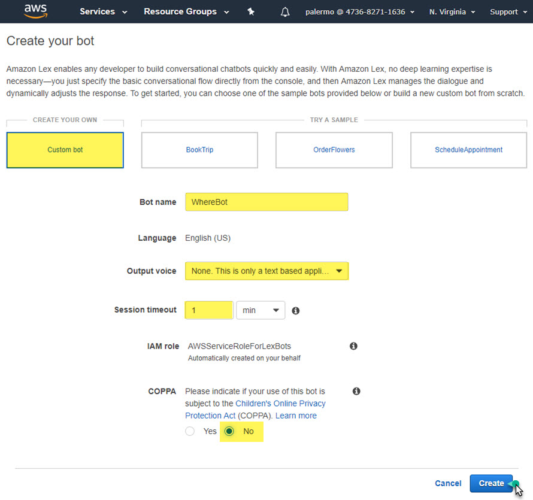
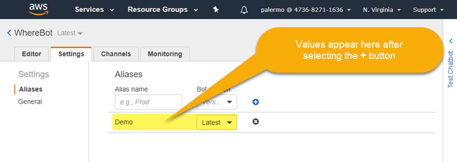
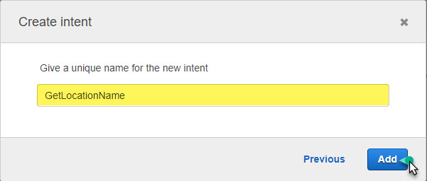
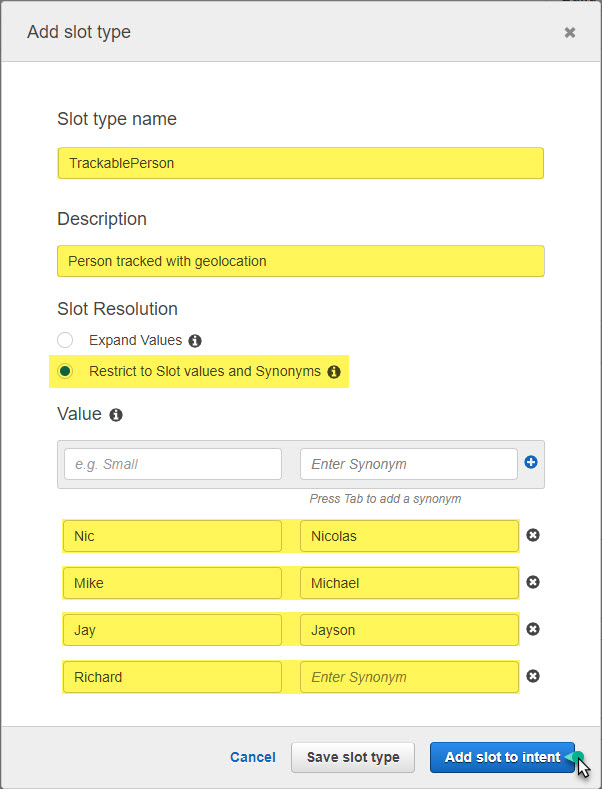
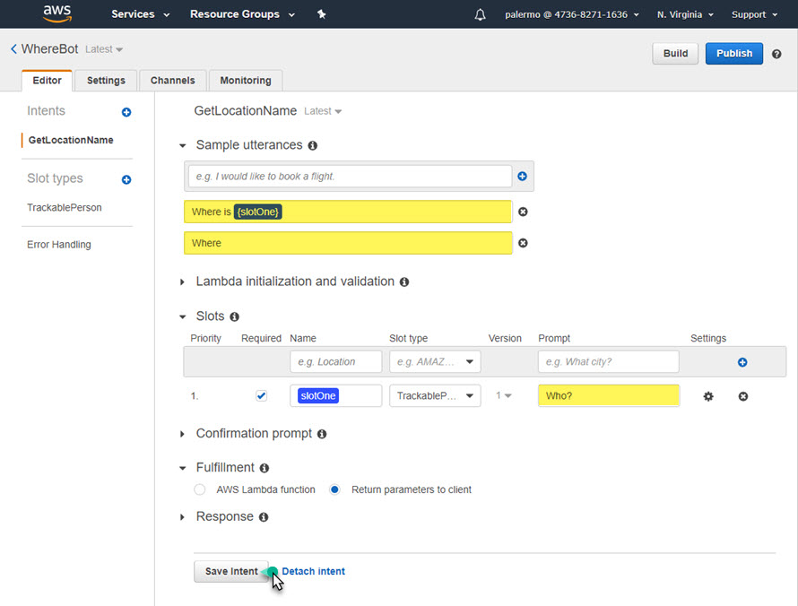

| [ Overview](./README.md) | [ Prerequisites](./02.md) |  Design | [ Development](./04.md) | [ Optional](./05.md)
| :---: | :---: | :---: | :---: | :---: |

# Lex Workhsop

## Design

In this section you will create a Lex chatbot and then design the conversational user experience (UX). You will test the conversation UX before adding any business logic.

___

### 1. Create Lex Chatbot

**Task:** You will sign in to AWS console, access the Amazon Lex service, and create a new custom bot named "WhereBot". You will configure your bot to be a text-based chat bot. You will assign 

<strong>Step-by-step instructions</strong> (expand for details)

1. Sign in with your AWS developer account at https://console.aws.amazon.com. Under AWS services, type "Lex", then select **Amazon Lex**:

     

1. If this is your first time, select the **Get Started** button

1. On the **Create your bot** screen, select **Custom bot** and apply the following values:
   * **Bot name:**           *WhereBot*
   * **Output voice:**       *None. This is only a text based application*
   * **Session timeout:**    *1 min*
   * **COPPA:**              *No*

     

    > After selecting the **Create** button, you should now be in the **WhereBot** Lex service with **Editor** as the active tab.

1. Select the **Settings** tab and confirm **Aliases** is the selected option. Apply the following values and then select the **+** button:
   * **Alias name:**        *Demo*
   * **Bot Version:**      *Latest*

     

   > Switch back to **Editor** tab. You have successfully created your Lex custom bot. Now it is time to design it.

___

### 2. Design the Conversational UX

**Task:** You will create a new Intent named GetLocationName and design it to answer a question such as: *Where is Nic?* You will create another Intent named GetDistance and design it to answer a question such as: *What is the distance between Nic and Michael?* You will test both intents for conversational accuracy. 

<strong>Step-by-step instructions</strong> (expand for details)

1. In the **Editor** tab, select the **+ Create Intent** button. In the pop-up dialogue box, select **+ Create intent** option. Type "GetLocationName" and select **Add** button.

     

   > After selecting the **Add** button, you should now see **GetLocationName** at the top of the main panel.

1. Select the **Slot types +** option from left panel. In the pop-up dialogue box, select **+ Create slot type** option. Type in the following for each field:
   * **Slot type name:**    *TrackablePerson*
   * **Description:**       *Person tracked with geolocation*
   * **Slot Resolution:**   *Restrict to Slot values and Synonyms*
   * **Value:** 
      * Nic: Nicolas
      * Mike: Michael
      * Jay: Jayson
      * Richard *(no synonym)* 

   

    > After selecting the **Add slot to intent** button, you should now see a new line in the **Slots** section with the name of **slotOne** and a type of **TrackablePerson**.

1.  Type "Who?" for the **Prompt** value for **slotOne**

1.  Add the following values for **Sample utterances** (select **+** to add each value):
   * *Where*
   * *Where is {slotOne}*

    

1.  Select the **Save Intent** button.

