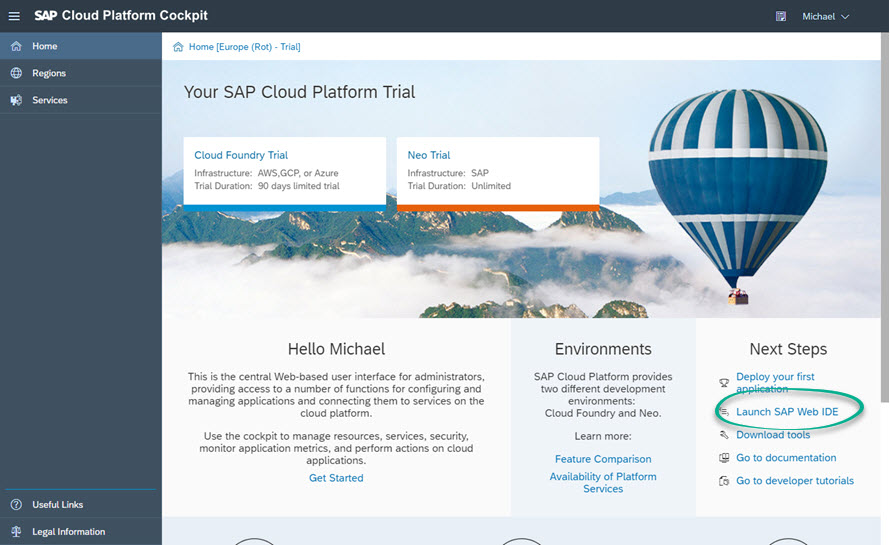
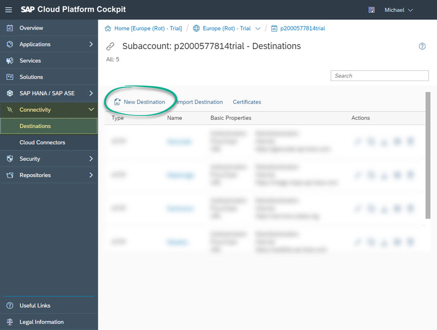
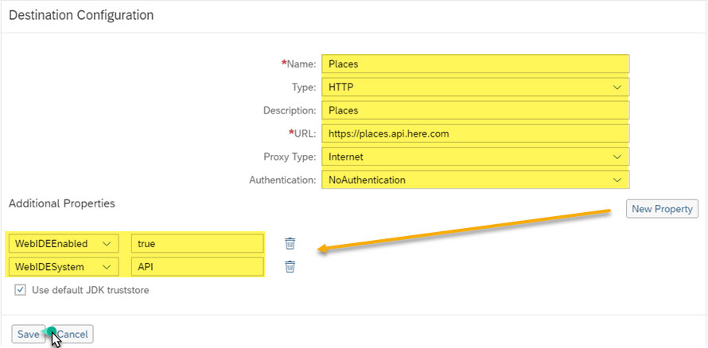
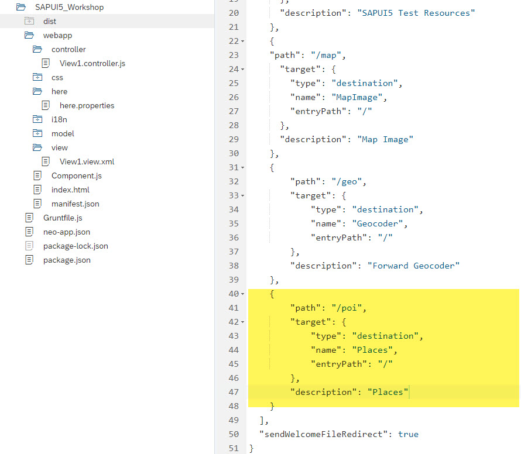

| [<br>Overview](./README.md) | [<br>Prerequisites](./02.md) | [<br>Discovery](./03.md) | <br>Configuration | [<br>Development](./05.md)
| :---: | :---: | :---: | :---: | :---: |

## Configuration

Navigate to https://account.hanatrial.ondemand.com/cockpit#/home/trialhome and log on with your SAP account. In the "Next Steps" section on the page, choose *Launch SAP Web IDE*:



Choose *SAP Cloud Platform Cockpit*


From the menu, find the "Destinations" option under "Connectivity" and choose *New Destination*:



Configure the destination as shown below. Use the "New Property" button to add the two additional fields:



Save your work. You have created a new destination to allow the HERE Places API to be used in an SAPUI5 project.

### Configure Destination

Open your project from the previous workshop. Find the "neo-app.json" file and add the following node to support the Places destination created in previous step:


``` javascript
    {
    	"path": "/places",
        "target": {
        	"type": "destination",
        	"name": "Places",
        	"entryPath": "/"
    	},
    	"description": "Places"
    }
```

Your new node should be placed in JSON as shown here:



Save changes.

[Proceed to next section](./05.md)
